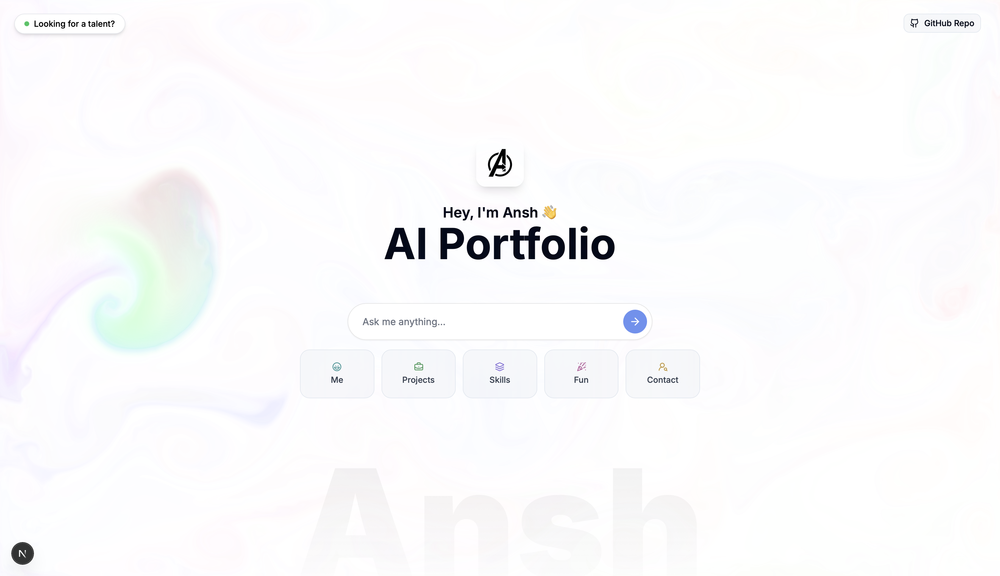

# 🤖 AI Portfolio - Interactive Developer Portfolio

<div align="center">


**🚀 Static portfolios are dead. Welcome to the future of interactive portfolios.**



[](https://ai-portfolio-main.netlify.app)
[](https://github.com/AnshAggr1303/ai-portfolio/stargazers)
[](LICENSE)

</div>

---

## 🌟 Why This Portfolio is Different

Instead of making you scroll endlessly through sections, my portfolio **adapts to YOU**. Powered by Google's Gemini AI, it creates truly conversational experiences. Ask a question — get instant, personalized responses about my work, skills, and adventures.

---

## 💬 What Can You Ask?

<table>
<tr>
<td width="25%" align="center">

🧠 **Tech Recruiter?**
<br><sub>Ask about my stack, projects & results</sub>

</td>
<td width="25%" align="center">

💻 **Developer?**
<br><sub>Dive deep into my code & technical mindset</sub>

</td>
<td width="25%" align="center">

🧑‍🤝‍🧑 **Friend or Family?**
<br><sub>See what I've been working on lately</sub>

</td>
<td width="25%" align="center">

🏔️ **Adventure Seeker?**
<br><sub>Hear about my Kedarnath trek stories!</sub>

</td>
</tr>
</table>

<div align="center">

### This is not a portfolio. It's a **conversation tailored to your curiosity**.

**[🚀 Try it live →](https://ai-portfolio-main.netlify.app)**

</div>

---

## ✨ Key Features

<div align="center">

| Feature | Description |
|---------|-------------|
| 🤖 **AI-Powered Chat** | Interactive conversations using Google Gemini AI |
| 📱 **Responsive Design** | Works seamlessly on all devices |
| 🎨 **Modern UI/UX** | Clean, professional design with smooth animations |
| 🚀 **Fast Performance** | Built with Next.js 15 for optimal speed |
| 📊 **Dynamic Components** | Smart rendering of projects, skills, contact info |
| 🔄 **Real-time Interactions** | Instant responses and smooth transitions |
| 🎯 **Smart Query Detection** | Automatically shows relevant content based on user queries |
| 📸 **Personal Stories** | Share adventures and experiences dynamically |

</div>

---

## 🛠️ Tech Stack

<div align="center">

### Frontend Technologies


### AI & Backend


### UI & Development


</div>

---

## 🚀 Quick Start

<div align="center">

**Want to run this project locally? Here's your 5-minute setup guide:**

</div>

### 📋 Prerequisites
- 
- 
- 

### ⚡ Installation

```bash
# 1️⃣ Clone the repository
git clone https://github.com/AnshAggr1303/ai-portfolio.git
cd ai-portfolio

# 2️⃣ Install dependencies
npm install

# 3️⃣ Create environment file
echo "GEMINI_API_KEY=your_gemini_api_key_here" > .env.local

# 4️⃣ Start development server
npm run dev

# 5️⃣ Open your browser
# Navigate to http://localhost:3000
```

<div align="center">

**🔑 Get your API Key:** [Google AI Studio](https://makersuite.google.com/app/apikey)

</div>

---

## 🎯 How It Works

### 💬 Chat Commands
<div align="center">

| Command Type | Examples | Response |
|--------------|----------|----------|
| 🔧 **Projects** | "Show me your projects", "What have you built?" | Interactive project carousel |
| 🧠 **Skills** | "What are your skills?", "Your tech stack?" | Dynamic skills matrix |
| 📞 **Contact** | "How can I reach you?", "Your contact info?" | Contact cards with links |
| 🏔️ **Adventures** | "Tell me something fun", "Any crazy stories?" | Personal adventure stories |
| 📄 **Resume** | "Can I see your resume?", "Download your CV" | Direct resume access |
| 💭 **General** | Any other questions | Natural AI conversation |

</div>

### 🤖 AI Features
- **Natural Language Processing** - Understands context and intent
- **Smart Component Rendering** - Shows relevant UI based on queries  
- **Personality-Driven Responses** - Conversational and engaging
- **Context-Aware** - Remembers conversation flow

---

## 🌟 Key Components

<div align="center">

### 🎨 Interactive Elements

| Component | Purpose | Features |
|-----------|---------|----------|
| 🗣️ **Chat Interface** | Real-time AI conversations | Smart query detection, contextual responses |
| 🎠 **Projects Carousel** | Interactive showcase of work | Apple-style cards, smooth animations |
| 🧩 **Skills Matrix** | Technical and soft skills display | Dynamic rendering, categorized skills |
| 📇 **Contact Cards** | Multiple ways to get in touch | Direct links, social media integration |
| 📖 **Adventure Stories** | Personal experiences and photos | Dynamic content, engaging narratives |
| 📄 **Resume Download** | Direct access to CV | One-click download functionality |

</div>

---

## 🚢 Deployment

<div align="center">

### Deploy to Netlify
[](https://app.netlify.com/start/deploy?repository=https://github.com/AnshAggr1303/ai-portfolio)

**Build Settings:**
- Build command: `npm run build`
- Publish directory: `.next`
- Add `GEMINI_API_KEY` in environment variables

### Deploy to Vercel
[](https://vercel.com/new/clone?repository-url=https%3A%2F%2Fgithub.com%2FAnshAggr1303%2Fai-portfolio)

**Environment Variables Required:**
```env
GEMINI_API_KEY=your_gemini_api_key_here
```

</div>

---

## 🎨 Customization Guide

### 🔧 Make It Yours

<details>
<summary><b>🎯 Personal Information</b></summary>

1. **Update Profile Details** in `src/components/ui/ProfileCard.tsx`
2. **Modify Contact Info** in `src/components/ui/contact.tsx`
3. **Add Your Projects** in `src/components/projects/Data.tsx`
4. **Update Skills** in `src/components/ui/skills.tsx`
5. **Personal Stories** in `src/components/ui/crazy.tsx`

</details>

<details>
<summary><b>🤖 AI Responses</b></summary>

1. **Modify AI personality** in `src/lib/ragService.ts`
2. **Update chat responses** in `src/components/ChatInterface.tsx`
3. **Add new query patterns** in quick questions
4. **Customize component triggers** based on user queries

</details>

<details>
<summary><b>🎨 Styling & UI</b></summary>

1. **Colors & Theme** - Update Tailwind classes
2. **Animations** - Modify Framer Motion configs
3. **Layout** - Adjust component positioning
4. **Typography** - Change fonts in `globals.css`

</details>

---

## 📊 Performance & SEO

<div align="center">

### Built for Speed & Discovery


</div>

- ⚡ **Next.js 15** - Latest performance optimizations
- 🔍 **SEO Ready** - Meta tags, structured data, sitemap
- 📱 **Mobile First** - Responsive design principles
- 🚀 **Fast Loading** - Optimized images, lazy loading
- 🔄 **Real-time** - Instant AI responses
- 📈 **Analytics Ready** - Easy integration with tracking tools

---

## 🧪 Testing

### Run Tests Locally

```bash
# Unit tests
npm run test

# E2E tests
npm run test:e2e

# Lint check
npm run lint

# Type check
npm run type-check
```

### Browser Compatibility

<div align="center">


</div>

---

## 🔒 Environment Variables

Create a `.env.local` file in your root directory:

```env
# Required
GEMINI_API_KEY=your_gemini_api_key_here

# Optional
NEXT_PUBLIC_SITE_URL=https://your-domain.com
NEXT_PUBLIC_GA_ID=your_google_analytics_id
NEXT_PUBLIC_HOTJAR_ID=your_hotjar_id
```

---

## 🤝 Contributing

<div align="center">

**Contributions are welcome! Here's how you can help:**

</div>

1. 🍴 Fork the repository
2. 🌿 Create a feature branch (`git checkout -b feature/amazing-feature`)
3. 💾 Commit your changes (`git commit -m 'Add amazing feature'`)
4. 📤 Push to the branch (`git push origin feature/amazing-feature`)
5. 🔀 Open a Pull Request

<div align="center">

[](https://github.com/AnshAggr1303/ai-portfolio/graphs/contributors)
[](https://github.com/AnshAggr1303/ai-portfolio/issues)
[](https://github.com/AnshAggr1303/ai-portfolio/pulls)

</div>

### 🐛 Found a Bug?

1. Check existing issues first
2. Create detailed bug report with:
   - Steps to reproduce
   - Expected vs actual behavior
   - Screenshots if applicable
   - Environment details

### 💡 Feature Requests

1. Check if feature already exists
2. Open feature request with:
   - Clear description
   - Use cases
   - Implementation ideas

---

## 📄 License

<div align="center">

This project is licensed under the **MIT License** - see the [LICENSE](LICENSE) file for details.

[](https://opensource.org/licenses/MIT)

</div>

---

## 🙏 Acknowledgments

<div align="center">

**Special thanks to the amazing tools and services that made this possible:**


</div>

---

## 📞 Let's Connect

<div align="center">

**Ready to chat? Find me here:**

[](mailto:anshagrawal148@gmail.com)
[](https://www.linkedin.com/in/ansh-agrawal-a69866298/)
[](https://github.com/AnshAggr1303)

**⭐ Star this repository if you found it helpful!**

</div>

---

<div align="center">

## 🏷️ Tags

`#AIPortfolio` `#InnovationInTech` `#NextJS` `#React` `#TypeScript` `#GeminiAI` `#Chatbot` `#InteractivePortfolio` `#WebDevelopment` `#FullStack` `#ModernUI` `#ResponsiveDesign` `#FramerMotion` `#TailwindCSS` `#DeveloperPortfolio` `#ConversationalAI` `#DigitalResume` `#JobSearch` `#TechInnovation` `#FutureTech`

---

<sub>💡 **Made with ❤️ by [Ansh Agrawal](https://github.com/AnshAggr1303) | Powered by AI | Built for the Future**</sub>

</div>