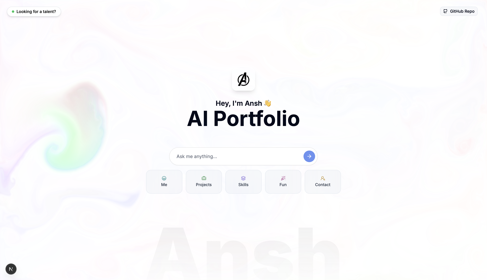

# 🤖 AI Portfolio - Interactive Developer Portfolio

**Static portfolios are dead.**

So I built a truly conversational portfolio powered by Google's Gemini AI. Instead of making you scroll endlessly through sections, my portfolio adapts to *you*. Ask a question — get instant, personalized responses about my work, skills, and adventures.



---

## 👇 What can you ask?

- 🧠 **Tech recruiter?** Ask about my stack, projects & results  
- 💻 **Developer?** Dive deep into my code & technical mindset  
- 🧑‍🤝‍🧑 **Friend or family?** See what I've been working on lately  
- 🏔️ **Adventure seeker?** Hear about my Kedarnath trek stories!

This is not a portfolio. It's a **conversation tailored to your curiosity**.

➡️ **Try it live:** [Portfolio URL](https://ai-portfolio-main.netlify.app)  
*What will you ask?*

---

## ✨ Features

* 🤖 **AI-Powered Chat Interface** - Interactive conversations using Google Gemini AI
* 📱 **Responsive Design** - Works seamlessly on all devices  
* 🎨 **Modern UI/UX** - Clean, professional design with smooth animations
* 🚀 **Fast Performance** - Built with Next.js 15 for optimal speed
* 📊 **Dynamic Components** - Smart rendering of projects, skills, contact info
* 🔄 **Real-time Interactions** - Instant responses and smooth transitions
* 🎯 **Smart Query Detection** - Automatically shows relevant content based on user queries
* 📸 **Personal Stories** - Share adventures and experiences dynamically

---

## 🛠️ Tech Stack

### Frontend
* **Next.js 15.1.0** - React framework for production
* **React 19.1.0** - UI library  
* **TypeScript** - Type-safe JavaScript
* **Tailwind CSS** - Utility-first CSS framework
* **Framer Motion** - Animation library

### AI & Backend
* **Google Gemini AI** - Conversational AI API
* **Next.js API Routes** - Serverless backend functions

### UI Components & Icons
* **Lucide React** - Beautiful icon library
* **Radix UI** - Accessible component primitives

### Development & Deployment
* **ESLint** - Code linting
* **PostCSS** - CSS processing
* **Vercel/Netlify** - Deployment platforms

---

## 🚀 How to Run

Want to run this project locally? Here's what you need:

### Prerequisites
- **Node.js** (v18 or higher)
- **npm** or **yarn** package manager
- **Google Gemini API key** (for AI chat functionality)

### Setup

1. **Clone the repository**
   ```bash
   git clone https://github.com/AnshAggr1303/ai-portfolio.git
   cd ai-portfolio
   ```

2. **Install dependencies**
   ```bash
   npm install
   ```

3. **Environment variables**
   Create a `.env.local` file in the root directory:
   ```env
   GEMINI_API_KEY=your_gemini_api_key_here
   ```

4. **Run the development server**
   ```bash
   npm run dev
   ```

5. **Open your browser**
   Navigate to `http://localhost:3000`

### Getting your API Key
- **Google Gemini API Key**: Get it from [Google AI Studio](https://makersuite.google.com/app/apikey)

---

## 🌟 Key Components

### 🗣️ Chat Interface
* Real-time AI conversations
* Smart query detection for projects, skills, contact, and fun stories
* Contextual responses with appropriate UI components

### 🎨 Dynamic Components
* **Projects Carousel** - Interactive showcase of work
* **Skills Matrix** - Technical and soft skills display  
* **Contact Cards** - Multiple ways to get in touch
* **Adventure Stories** - Personal experiences and photos
* **Resume Download** - Direct access to CV

### 🤖 AI Features
* Natural language processing
* Context-aware responses
* Personality-driven conversations
* Smart component rendering based on user intent

---

## 📝 Usage

### Chat Commands
Users can ask about:
* **Projects**: "Show me your projects", "What have you built?"
* **Skills**: "What are your skills?", "What technologies do you use?"
* **Contact**: "How can I reach you?", "Your contact information?"
* **Adventures**: "Tell me something fun", "What's the craziest thing you've done?"
* **Resume**: "Can I see your resume?", "Download your CV"
* **General**: Any other questions for natural conversation

### Customization
1. **Update personal information** in component files
2. **Modify AI responses** in `ChatInterface.tsx`
3. **Add new components** and query patterns
4. **Customize styling** with Tailwind classes

---

## 🚢 Deployment

### Netlify
1. Build command: `npm run build`
2. Publish directory: `.next`
3. Add environment variables in Netlify settings
4. Deploy

---

## 📊 Project Structure

```
ai-portfolio/
├── src/
│   ├── app/
│   │   ├── api/chat/
│   │   │   └── route.ts          # AI chat API endpoint
│   │   ├── chat/
│   │   │   └── page.tsx          # Chat interface page
│   │   ├── favicon.ico           # Site favicon
│   │   ├── globals.css           # Global styles
│   │   ├── layout.tsx            # Root layout component
│   │   └── page.tsx              # Home page
│   ├── components/
│   │   ├── chat/
│   │   │   ├── ChatInput.tsx     # Chat input component
│   │   │   ├── ChatScreen.tsx    # Main chat screen
│   │   │   └── MessagesArea.tsx  # Messages display area
│   │   ├── projects/
│   │   │   ├── AllProjects.tsx   # Projects showcase
│   │   │   ├── apple-cards-caro... # Apple-style project carousel
│   │   │   └── Data.tsx          # Project data
│   │   ├── ui/
│   │   │   ├── badge.tsx         # Badge component
│   │   │   ├── card.tsx          # Card component
│   │   │   ├── contact.tsx       # Contact information
│   │   │   ├── crazy.tsx         # Adventure stories
│   │   │   ├── photos.tsx        # Photo gallery
│   │   │   ├── ProfileCard.tsx   # Profile card component
│   │   │   ├── resume.tsx        # Resume component
│   │   │   ├── separator.tsx     # UI separator
│   │   │   └── skills.tsx        # Skills display
│   │   ├── ChatInterface.tsx     # Main chat interface
│   │   └── loading-screen.tsx    # Loading screen component
│   ├── constants/
│   │   └── quickQuestions.ts     # Predefined chat questions
│   ├── hooks/
│   │   └── use-outside-click.tsx # Outside click detection hook
│   ├── lib/
│   │   ├── ragService.ts         # RAG service for AI context
│   │   └── utils.tsx             # Utility functions
│   └── types/
│       └── chat.ts               # Chat-related TypeScript types
├── public/                       # Static assets and images
├── .env.local                    # Environment variables
└── README.md                     # You are here!
```

---

## 🤝 Contributing

1. Fork the repository
2. Create a feature branch (`git checkout -b feature/amazing-feature`)
3. Commit changes (`git commit -m 'Add amazing feature'`)
4. Push to branch (`git push origin feature/amazing-feature`)
5. Open a Pull Request

---

## 📄 License

This project is licensed under the MIT License - see the LICENSE file for details.

---

## 🙏 Acknowledgments

* **Google Gemini AI** for powerful conversational capabilities
* **Netlify** for seamless deployment
* **Next.js Team** for the amazing framework
* **Tailwind CSS** for beautiful styling utilities
* **Framer Motion** for smooth animations

---

## 📞 Contact

**Ansh Agrawal**
* 📧 Email: [my mail](mailto:anshagrawal148.com)
* 💼 LinkedIn: [my linkedIN](https://www.linkedin.com/in/ansh-agrawal-a69866298/)
* 🐙 GitHub: [my github](https://github.com/AnshAggr1303)

---

⭐ **Star this repository if you found it helpful!**

#### 🔖 Tags
`#AIPortfolio` `#InnovationInTech` `#NextJS` `#React` `#TypeScript` `#GeminiAI` `#Chatbot` `#InteractivePortfolio` `#WebDevelopment` `#FullStack` `#ModernUI` `#ResponsiveDesign` `#FramerMotion` `#TailwindCSS` `#DeveloperPortfolio` `#ConversationalAI` `#DigitalResume` `#JobSearch` `#TechInnovation` `#FutureTech`